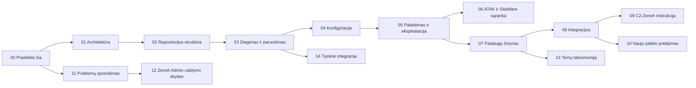

# 00 — Pradėkite čia

Tai EFDI jutiklių sujungimo (sensor-fusion) pod'o operatoriaus vadovas. Jei
šią repozitoriją matote pirmą kartą, pirmiausia perskaitykite šį puslapį,
o tada rinkitės dokumentą pagal tai, ką šiuo metu darote — dokumentai
sunumeruoti maždaug ta tvarka, kokia jų reikėtų diegiant pirmą kartą, bet
niekas netrukdo iškart šokti prie problemų sprendimo, jei būtent to
reikia.

Svarbu žinoti iš karto: kartą įdiegtas, EFDI toliau veikia beveik
savarankiškai — `start.sh` palaiko natyvius procesus gyvus per
`supervisor.py`, o bet kokie konfigūracijos pakeitimai po pradinės
sąrankos daromi per WebUI (žr. [08](08-integracijos.md)), ne rankiniu
failų redagavimu pačiame hoste. Todėl prieš improvizuojant visada verta
pirmiau atsiversti tą dokumentą, kuris atitinka jūsų dabartinę užduotį.

## Nuo ko pradėti

| Situacija | Dokumentas |
| --- | --- |
| Pirmą kartą matote šią repozitoriją | [01 — Architektūra](01-architektura.md) |
| Norite žinoti, kas kur yra | [02 — Repozitorijos struktūra](02-repozitorijos-struktura.md) |
| Diegiate švariame serveryje | [03 — Diegimas ir paruošimas](03-diegimas-ir-paruosimas.md) |
| Kažkas neveikia | [11 — Problemų sprendimas](11-dazniausios-problemos.md) |
| Reikia prijungti naują jutiklį | [10 — Naujo jutiklio pridėjimas](10-naujo-jutiklio-pridejimas.md) |
| Reikia keisti veikiančią konfigūraciją | [08 — Integracijos](08-integracijos.md) |

## Dokumentų žemėlapis

## Pilnas dokumentų sąrašas

| Dokumentas | Tipas | Apima |
| --- | --- | --- |
| [01-architektura.md](01-architektura.md) *(EN: [01-architecture.md](01-architecture.md))* | Paaiškinimas | Visa sistema nuo pagrindų: duomenų srautas, temų taksonomija, mesh/sertifikatai, vykdymo modelis, saugumas, patikrinti keliai, pastebėti dalykai |
| [02-repozitorijos-struktura.md](02-repozitorijos-struktura.md) *(EN: [02-repo-structure.md](02-repo-structure.md))* | Žinynas | Katalogai ir kas kam priklauso |
| [03-diegimas-ir-paruosimas.md](03-diegimas-ir-paruosimas.md) *(EN: [03-bootstrap-and-install.md](03-bootstrap-and-install.md))* | Instrukcija | Nuo tuščio serverio iki veikiančio pod'o — reikalavimai, diegimas, sertifikatai |
| [04-konfiguracija.md](04-konfiguracija.md) *(EN: [04-configuration.md](04-configuration.md))* | Instrukcija | `compose/.env` laukai, privalomi ir neprivalomi |
| [05-paleidimas-ir-eksploatacija.md](05-paleidimas-ir-eksploatacija.md) *(EN: [05-launching-and-operations.md](05-launching-and-operations.md))* | Instrukcija | Steko paleidimas, paslaugų stabdymas, žurnalų ir būsenos patikros |
| [06-atak-ir-sitaware-saranka.md](06-atak-ir-sitaware-saranka.md) *(EN: [06-atak-and-sitaware-setup.md](06-atak-and-sitaware-setup.md))* | Instrukcija | ATAK multicast/TAK serveris, SitaWare HQ, NFFI, piktogramų žinynas |
| [07-paslaugu-zinynas.md](07-paslaugu-zinynas.md) *(EN: [07-service-reference.md](07-service-reference.md))* | Žinynas | Kiekviena tilto, sluoksnio ir protokolo paslauga — kas ji tokia ir ką daro |
| [08-integracijos.md](08-integracijos.md) *(EN: [08-integrations.md](08-integrations.md))* | Žinynas + instrukcija | Protokolų prisijungimo reikalavimai, išvesties peržiūros, integruotos schemos, klientų SDK |
| [09-c2-zenoh-instrukcija.md](09-c2-zenoh-instrukcija.md) *(EN: [09-c2-zenoh-runbook.md](09-c2-zenoh-runbook.md))* | Instrukcija | Kaip patikrinti ir išbandyti C2 ↔ Zenoh dvikryptį kelią |
| [10-naujo-jutiklio-pridejimas.md](10-naujo-jutiklio-pridejimas.md) *(EN: [10-adding-a-sensor.md](10-adding-a-sensor.md))* | Instrukcija | Žingsnis po žingsnio, kaip prijungti naują jutiklį ar protokolą |
| [11-dazniausios-problemos.md](11-dazniausios-problemos.md) *(EN: [11-troubleshooting.md](11-troubleshooting.md))* | Problemų sprendimas | Simptomais pagrįsti sprendimai, žinomi pastebėti dalykai |
| [12-zenoh-admin-valdymo-skydas.md](12-zenoh-admin-valdymo-skydas.md) *(EN: [12-zenoh-admin-gui.md](12-zenoh-admin-gui.md))* | Žinynas | Web administravimo skydas: sąranka, puslapiai, rolės, valdoma CA |
| [13-temu-taksonomija.md](13-temu-taksonomija.md) *(EN: [13-topic-taxonomy.md](13-topic-taxonomy.md))* | Žinynas | Skelbiamų Zenoh raktų sutartis |
| [14-tesine-integracija.md](14-tesine-integracija.md) *(EN: [14-continuous-integration.md](14-continuous-integration.md))* | Žinynas | CI patikros, pakeitimų žurnalas |
| [references/](references/README.md) | Žinynas | Šaltinio ir pasitikėjimo pastabos apie kiekvieną išorinę specifikaciją (ASTERIX, SAPIENT, STANAG, TAK, SitaWare) |
| [superpowers/](superpowers/) | Vidinis | AI-asistuoto projektavimo ir planavimo archyvas — kūrimo istorija, ne operatoriaus dokumentacija |

## Konvencijos

- Kiekvienas sunumeruotas dokumentas (00-14) turi anglišką ir lietuvišką
  versiją, vieną kitos vertimą nuo pradžios iki galo — pakeitę vieną,
  atnaujinkite ir antrą.
- Autoritetingos kodavimo taisyklės ir ASTERIX bitų lygio niuansai aprašyti
  ne čia, o repozitorijos šaknyje esančiame
  [`../.ai/.claude/CLAUDE.md`](../.ai/.claude/CLAUDE.md).
- Prisidėjimo taisyklės ir pažeidžiamumų atskleidimo tvarka aprašyti
  šaknies lygio failuose [`../CONTRIBUTING.md`](../CONTRIBUTING.md) ir
  [`../SECURITY.md`](../SECURITY.md) — čia jų nekartojame.
