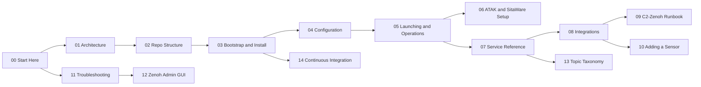

# 00 — Start Here

Operator manual for the EFDI sensor-fusion pod. If this is your first time
in this repo, read this page, then jump to whichever doc below matches what
you're trying to do — the docs are numbered in roughly the order you'd need
them on a first deployment, but nothing stops you from jumping straight to
troubleshooting.

Default posture: EFDI is mostly self-running once deployed — `start.sh`
keeps native processes alive via `supervisor.py`, and config changes after
initial setup are WebUI-driven (see [08](08-integrations.md)), not files you
hand-edit on the host. Read the doc for what you're doing before improvising.

## Where to start

| Situation | Document |
| --- | --- |
| First time seeing this repo | [01 — Architecture](01-architecture.md) |
| Want to know what lives where | [02 — Repo Structure](02-repo-structure.md) |
| Deploying on a fresh host | [03 — Bootstrap & Install](03-bootstrap-and-install.md) |
| Something's broken | [11 — Troubleshooting](11-troubleshooting.md) |
| Need to wire in a new sensor | [10 — Adding a New Sensor](10-adding-a-sensor.md) |
| Need to change running config | [08 — Integrations](08-integrations.md) |

## Document map

## Full document list

| Document | Type | Covers |
| --- | --- | --- |
| [01-architecture.md](01-architecture.md) | Explanation | The whole system ground-up: data flow, topic taxonomy, mesh/certs, runtime model, security, golden paths, gotchas |
| [02-repo-structure.md](02-repo-structure.md) | Reference | Directories and what owns what |
| [03-bootstrap-and-install.md](03-bootstrap-and-install.md) *(LT: [03-diegimas-ir-paruosimas.md](03-diegimas-ir-paruosimas.md))* | How-to | Bare host to running pod — prerequisites, install, certs |
| [04-configuration.md](04-configuration.md) *(LT: [04-konfiguracija.md](04-konfiguracija.md))* | How-to | `compose/.env` fields, required vs optional |
| [05-launching-and-operations.md](05-launching-and-operations.md) *(LT: [05-paleidimas-ir-eksploatacija.md](05-paleidimas-ir-eksploatacija.md))* | How-to | Starting the stack, stopping services, log/health checks |
| [06-atak-and-sitaware-setup.md](06-atak-and-sitaware-setup.md) *(LT: [06-atak-ir-sitaware-saranka.md](06-atak-ir-sitaware-saranka.md))* | How-to | ATAK multicast/TAK Server, SitaWare HQ, NFFI, icon reference |
| [07-service-reference.md](07-service-reference.md) *(LT: [07-paslaugu-zinynas.md](07-paslaugu-zinynas.md))* | Reference | Every bridge/layer/protocol service, what it does |
| [08-integrations.md](08-integrations.md) *(LT: [08-integracijos.md](08-integracijos.md))* | Reference + how-to | Protocol connection requirements, egress views, vendored schemas, client SDKs |
| [09-c2-zenoh-runbook.md](09-c2-zenoh-runbook.md) *(LT: [09-c2-zenoh-instrukcija.md](09-c2-zenoh-instrukcija.md))* | How-to | Verifying and exercising the C2 ↔ Zenoh bidirectional path |
| [10-adding-a-sensor.md](10-adding-a-sensor.md) *(LT: [10-naujo-jutiklio-pridejimas.md](10-naujo-jutiklio-pridejimas.md))* | How-to | Step-by-step: wire in a new sensor or protocol |
| [11-troubleshooting.md](11-troubleshooting.md) *(LT: [11-dazniausios-problemos.md](11-dazniausios-problemos.md))* | Troubleshooting | Symptom-first fixes, known gotchas |
| [12-zenoh-admin-gui.md](12-zenoh-admin-gui.md) | Reference | The web admin panel — setup, pages, roles, managed CA |
| [13-topic-taxonomy.md](13-topic-taxonomy.md) | Reference | The published Zenoh key contract |
| [14-continuous-integration.md](14-continuous-integration.md) *(LT: [14-tesine-integracija.md](14-tesine-integracija.md))* | Reference | CI checks, changelog |
| [references/](references/README.md) | Reference | Source-and-trust notes for every external spec (ASTERIX, SAPIENT, STANAG, TAK, SitaWare) |
| [superpowers/](superpowers/) | Internal | AI-assisted design/planning archive — development history, not operator documentation |

## Conventions

- Numbered docs 03-11 and 14 are English/Lithuanian pairs, translations of
  each other cover-to-cover — keep them in step when either changes.
  01, 02, 12, and 13 are English-only.
- The authoritative coding rules and ASTERIX bit-level gotchas live in the
  repo-root [`../.ai/.claude/CLAUDE.md`](../.ai/.claude/CLAUDE.md), not here.
- Root-level [`../CONTRIBUTING.md`](../CONTRIBUTING.md) and
  [`../SECURITY.md`](../SECURITY.md) cover contribution rules and
  vulnerability disclosure — not duplicated here.
