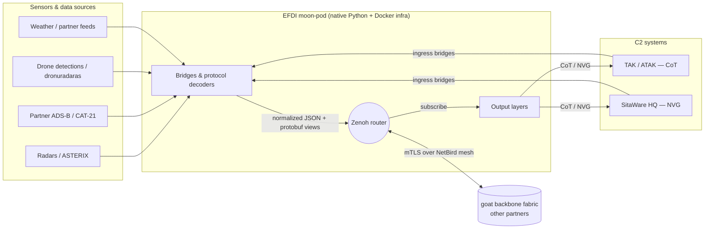
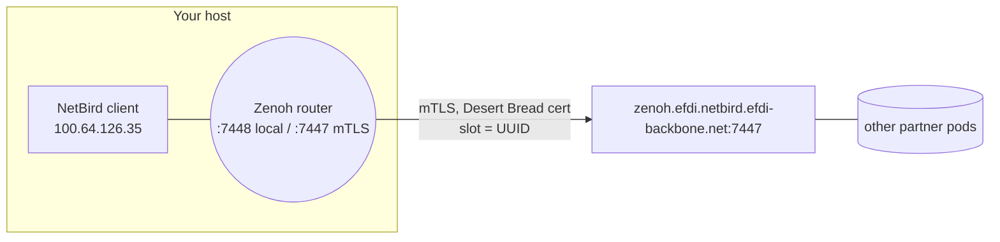

# 01 — Architecture (EFDI, explained from A to Z)

A ground-up, read-it-once explanation of the whole project: what it is, why each
piece exists, how data actually moves, and how to operate it. Written so you can
study it end to end and explain it to someone else without opening the code.

If you only read one section, read **[2. The one-sentence model](#2-the-one-sentence-model)**
and **[6. How data actually flows](#6-how-data-actually-flows)**.

---

## 1. What EFDI is

EFDI is a **sensor-to-C2 translator with a shared message fabric in the middle.**

On one side are *sensors and data sources* that each speak their own dialect —
radars speaking ASTERIX, aircraft transponders speaking ADS-B, acoustic
drone-detection sensors, weather stations, partner feeds, and so on. On the other side are
*command-and-control (C2) systems* that operators actually look at — **TAK**
(ATAK/WinTAK) which speaks Cursor-on-Target (CoT), and **SitaWare HQ** which
speaks NVG.

In the middle is **Zenoh**, a publish/subscribe fabric. EFDI decodes each sensor
dialect into one normalized track model, publishes it onto Zenoh under a
disciplined topic name, and then encodes it back out into whatever each C2 system
speaks. It also does the reverse — pulls tracks *out* of the C2 systems back onto
the fabric — so the picture is shared in both directions.

EFDI runs as a **"moon-pod"**: a self-contained bundle a partner runs on their
own hardware, on their own network, that connects to a shared **backbone fabric**
so many partners exchange tracks without anyone surrendering custody of their
data.

**Where it sits — this is important.** EFDI is meant primarily as an *addition*
alongside your existing C2 stack, not a replacement for it. It runs next to (or
at least in direct network reach of) the TAK Server and SitaWare HQ servers
themselves, and speaks their native wire protocols directly — CoT over the TAK
TCP port, NVG over SitaWare's HTTP feed. That direct-to-the-server placement is
the entire reason the translation layers exist: EFDI carries the burden of
speaking each C2 system's dialect so the operators' tools receive exactly what
they already expect, with EFDI adding fused, multi-source tracks into that
picture rather than asking anyone to change how they work.

## 2. The one-sentence model

> **Decode many sensor dialects → normalize to one track → publish on Zenoh with
> a strict topic name → encode back out to each C2 system (and pull the C2
> systems' tracks back in).**

Everything else — the mesh VPN, the certificates, the taxonomy, the web UI, the
supervisor — exists to make that one sentence reliable, secure, and operable.

## 3. The big picture



Read it as three stages: **ingest** (left), **fabric** (middle), **egress**
(right) — plus a fourth thing, the **backbone**, which is just more subscribers
and publishers reachable over a VPN mesh.

## 4. Core vocabulary (the glossary you need)

| Term | What it is |
|---|---|
| **Zenoh** | The pub/sub fabric. Publishers `put` bytes on a *key* (a topic like `a/b/c`); subscribers match keys with wildcards (`a/**`). Brokerless — routers just forward. |
| **key / topic** | The slash-separated name a sample is published under. EFDI's key structure is the *taxonomy* (§6.3). |
| **ASTERIX** | EUROCONTROL binary radar format. Categories (CAT-048 targets, CAT-034 service, CAT-021 ADS-B, CAT-020 MLAT, CAT-062 system tracks) each carry a sensing method. |
| **CoT** | Cursor-on-Target — the XML TAK/ATAK speaks. |
| **NVG** | NATO Vector Graphics 2.0.2 — the XML SitaWare consumes over an HTTP poll. |
| **SAPIENT / BSI Flex 335** | A standard sensor-message schema. EFDI's *canonical fabric contract* view is a SAPIENT protobuf. |
| **track** | One normalized observation: a dict with position, identity, affiliation, timestamps. The lingua franca between decode and encode. |
| **bridge** | A process that brings an external source's data **into** Zenoh (ingress), or pulls a C2 system in. Prefix names the direction. |
| **layer** | A process that pushes EFDI tracks **out** of Zenoh to a C2 system (egress). |
| **NetBird** | The WireGuard mesh VPN that connects the pod to the backbone (peers get `100.64.x.x` addresses). |
| **mTLS** | Mutual TLS — both ends present certificates. The pod's cert *is* its identity and its write permission on the fabric. |
| **slot / namespace** | The key prefix the pod is allowed to write. On the backbone it is the org **UUID** (`1851281…`). A write outside it is silently denied. |
| **backbone / fabric** | The shared goat Zenoh network many partners connect to. |
| **panoscope** | The backbone's inspection UI — draws **nodes** (from liveliness presence) and **edges** (from traffic) and a schema view. |
| **moon-pod** | The self-contained, partner-run EFDI bundle. |

## 5. The two networks (this trips everyone up)

There are **two different Zenoh worlds**, and the same pod talks to both:

1. **Local sandbox** — routers on your own network (the LTU sandbox). Prefix
   `LTU/CISB`. Used for development and local testing. Certs signed by the local
   `efdi-root-ca`.
2. **goat backbone** — the shared hackathon fabric at
   `zenoh.efdi.netbird.efdi-backbone.net:7447`, reached over the NetBird mesh.
   Prefix is your org **UUID**. Certs signed by the **Desert Bread** CA.

The pod's own Zenoh router **federates**: local bridges publish to the router on
`127.0.0.1:7448` (plaintext, loopback-only), and the router forwards everything
under your slot out to the backbone over mTLS. So a bridge never needs to know
about the backbone — it publishes locally and the router carries it.

> The single most common confusion: `LTU/CISB` (local) vs the UUID (backbone),
> and which CA signs which. Backbone = **UUID prefix + Desert Bread certs**.

## 6. How data actually flows

### 6.1 Ingest — from antenna to fabric

Take a radar as the worked example:

1. A radar emits **ASTERIX CAT-048** bytes over UDP.
2. `udp_ingress_bridge.py` receives the raw datagram and publishes it verbatim on
   a **raw** key (`{root}/raw/asterix/cat048`) — no decoding, just transport.
3. The ASTERIX decoder process (`protocols/vendors/asterix/cat.py`, selected with
   `--category`) subscribes to that raw key, decodes the binary record into a
   **track dict** (lat/lon, altitude, track number, SAC/SIC sensor id…), handling
   all the bit-level ASTERIX gotchas (documented in `../.ai/.claude/CLAUDE.md`).
4. The decoder calls the **publish helpers** in
   `protocols/track_views.py`, which assemble the taxonomy key and publish
   **several views of the same track** (§6.4).

Other sources are simpler — partner ADS-B arrives through registered fabric
topics or ASTERIX CAT-021. The pattern is always
**decode → track dict → publish helper.**

### 6.2 The normalized track

Every decoder produces the same shape — a flat dict such as:

```json
{ "_ts": 1730000000.0, "_src": "partner-adsb", "uid": "4ca7b3",
  "lat_deg": 54.68, "lon_deg": 25.28, "geo_alt_m": 10668,
  "callsign": "RYR1AB", "affiliation": "civ", "heading_deg": 91.0 }
```

This is the interface. Anything that can produce this dict can join the fabric;
anything that can consume it can render to a C2 system.

### 6.3 The topic key (the taxonomy)

The key is where the intelligence lives. Full form (see `topic-taxonomy.md`):

```
{prefix}/{domain}/{source}/{modality}/{affiliation}/{entity}/{type}/{id}[/{view}]/tracks/v1
```

- **prefix** — your slot (UUID on backbone).
- **domain** — `air` / `land` / `sea` / `space`.
- **source** — *who* observed it (`partner-adsb`, radar `SAC-SIC`). Provenance.
- **modality** — *how* it was observed (`radar`, `adsb`, `acoustic`). What a C2
  consumer filters on.
- **affiliation** — `civ` / `mil` / `friendly` / `hostile` / `neutral` / `unknown`.
- **entity / type / id** — what kind of thing, its specific type, its stable id.
- **view** — which *encoding* of the same object (§6.4).
- **`/tracks/v1`** — the mandatory fabric-contract tail (§7).

`semantic_topic()` in `track_views.py` is the **single** place that assembles
this key, so the taxonomy lives in one function, not at 26 publish sites.

### 6.4 The four views (one track, four encodings)

Each track is published under four sibling keys, so different consumers pick the
encoding they want without an out-of-band agreement:

| View | Key tail | Payload | Wire encoding |
|---|---|---|---|
| **json** (canonical) | `…/{id}/tracks/v1` | flat JSON | `application/json` |
| **sapient** | `…/{id}/sapient/tracks/v1` | BSI Flex 335 v2 protobuf (the contract) | `application/protobuf;…SapientMessage` |
| **proto** | `…/{id}/proto/tracks/v1` | EFDI per-protocol protobuf (full detail) | `application/protobuf;…<Track>` |
| **raw** | `…/{id}/raw/tracks/v1` | original wire bytes in a `RawEnvelope` | `application/protobuf;…RawEnvelope` |

The protobuf views are **self-describing**: the encoding string carries the
protobuf message name so the fabric's schema-viewer can decode them without a
side lookup (`proto_encoding()` in `track_views.py`).

### 6.5 Egress — from fabric to C2

Output layers subscribe with `**` wildcards (which absorb the `/tracks/v1` tail
automatically) and convert:

- **`tak_layer.py`** subscribes to track keys, builds **CoT XML**, and streams it
  to a **TAK Server** over TCP/TLS 8089. Non-JSON views are skipped so protobuf is
  never mis-parsed as JSON.
- **`sitaware_layer.py`** converts tracks to **NVG 2.0.2** items (APP-6 symbols) and
  serves them as one document over HTTP(S); **SitaWare polls** that endpoint.

### 6.6 Ingress from C2 (the reverse path)

- **`tak_bridge.py`** reads CoT XML from TAK and republishes normalized tracks to
  Zenoh, tagged so `tak_layer` doesn't echo them straight back.
- **`sitaware_bridge.py`** polls SitaWare's REST API for unit positions and
  republishes them — the only SitaWare ingress; there is no separate NVG-XML
  ingest bridge.

### 6.7 Runnable reference snippets

`examples/` holds illustrative, not production, reference code for producers
on the EFDI data fabric — adapt them rather than importing them. The canonical
contracts live in this document and `topic-taxonomy.md`; these are the "show
me working code" companions:

| Example | What it shows | Contract |
|---|---|---|
| `delivery_reconcile.py` | Producer-side delivery reconciliation — keep an intent ledger, self-canary (read your own output back), and emit an intent heartbeat so you (and the operator monitor) detect when writes silently stop landing. | the delivery-reconciliation pattern |
| `self_describing_encoding.py` | Set the Zenoh `Encoding` on publish so the wire says what format it carries (JSON / CBOR / protobuf-with-schema); pick a decoder off `sample.encoding` on the consumer instead of an out-of-band lookup. | self-describing payloads |
| `resilient_subscriber.py` | A subscriber that survives a partition — on (re)connect it catches up history for what it missed, periodically recovers dropped samples, and is notified which samples were missed (with a paired must-deliver publisher). | the advanced-subscriber pattern |
| `must_deliver_publisher.py` | The Tier-3 companion to delivery reconciliation: an advanced publisher that caches its recent samples (answers retransmission for its own keys), sequence-numbers + heartbeats for true miss detection, and advertises presence — edge-local reliability, not a broker. | the advanced-publisher pattern |
| `liveliness_presence.py` | Native presence — declare a liveliness token that says "I exist", and watch a presence key expression to learn the instant a peer joins or drops (incl. the current roster via history), instead of guessing from traffic. | the liveliness-presence pattern |

The last four are the "resilient / advanced" patterns — reach for them on the
streams that actually need catch-up, must-deliver, or presence. For
loss-tolerant telemetry, plain `put` + Tier-0 reconciliation is the right
default; don't pay for guarantees a stream doesn't need.

Connection config comes from your pod operator (router endpoint + mTLS
cert/key/CA-roots, generated by `scripts/gen-certs.sh`) — see each script's
header for the env vars. Deps: `pip install eclipse-zenoh==1.9.0` (the
fleet-pinned version); the advanced publisher/subscriber and liveliness APIs
live in the `zenoh.ext` and `session.liveliness()` surfaces of that package.

## 7. The fabric contract — why "am I in panoscope?" is a thing

Being *on* the backbone (bytes flowing) and being *shown* in panoscope are two
different signals. Three rules govern visibility:

1. **`/tracks/v1` tail.** The backbone ingress only admits track keys ending
   `/tracks/v1`. Miss it and your data is rejected at the boundary. (This was the
   regression that had everything except OpenSky rejected.)
2. **Liveliness presence = nodes.** panoscope draws a **node** from a Zenoh
   *liveliness token*, not from traffic. `compose/control/presence.py` declares one token
   per live feed at `{prefix}/_meta/alive/<service>`. Without it your data shows on
   edges but you are never drawn as a node.
3. **Self-describing encoding = schema families.** Protobuf tagged with its
   message name (`proto_encoding()`) lets the schema-viewer classify your views.
   Bare `application/protobuf` shows as unclassified.

All three are implemented. See `topic-taxonomy.md` §"Fabric contract".

## 8. How the pod connects (mesh, certs, slot)



- **NetBird** joins the host to the mesh (`netbird up` with the bundle's
  setup-key). Peers get `100.64.x.x` addresses; the mesh even runs its own DNS
  (`*.efdi.netbird.efdi-backbone.net`).
- The router dials the backbone gateway over **mTLS**. Its **client certificate**
  (subject `CN=<UUID>`, SAN `URI:urn:goat:efdi:org=<UUID>`, signed by Desert
  Bread) is simultaneously its identity and its **write permission**: it may only
  publish under `<UUID>/**`.
- `verify_name_on_connect` is currently **off** because the pod dials the router
  by mesh IP; the on-contract posture is to dial the DNS name with verification on
  (see the connection notes in `INSTALL.md` §7 Integrations).

## 9. Runtime & process model

EFDI is **native Python processes + a little Docker for infrastructure.**

- **Docker (infra only):** `zenoh-router`, `zenoh-admin` (web UI) + its DB and
  proxy, `step-ca` (local certificate authority), a docker-socket-proxy.
- **Native processes (the data plane):** every bridge, protocol decoder, and
  layer runs as a supervised Python process. `start.sh` launches them (writing a
  pidfile per service under `compose/state/.pids/`); `supervisor.py` sweeps every
  ~15s and restarts any whose pidfile is present but process is gone.
- **Two virtualenvs:** `compose/venv` (the eclipse-zenoh runtime) and
  `compose/zenoh-admin/.venv` (the web UI + test tooling).
- **Entry points:** `install.sh` (first-time setup), `start.sh` (interactive
  service menu + `--service <name>` non-interactive launch), `stop.sh`,
  `run.sh`.

To bring the data plane up and keep it up, `start.sh` is idempotent and the
supervisor is always running; a crashed feed comes back on its own.

## 10. What each service category is

| Category | Examples | Role |
|---|---|---|
| **Open-data bridges** | `meteolt` | Poll explicitly retained feeds → tracks |
| **Sensor bridges** | `asterix`, `sitaware`, `dronuradaras`, `track-fusion`, `*-raw` | Ingest sensors / raw sockets |
| **Protocols** | `sapient`, `stanag4586/4609`, `cap`, `geojson`, `mqtt`, `sensorthings`, `sparkplug`, `nffi` | Decode a wire protocol on a raw Zenoh topic → tracks |
| **Output layers** | `tak_layer`, `sitaware_layer` | Egress tracks → TAK / SitaWare |
| **C2 inputs** | `tak-bridge`, `sitaware` | Ingress from TAK / SitaWare |
| **Infrastructure** | `zenoh`, `admin-control`, `supervisor`, `presence`, `cert-renewer` | Router, web UI, keep-alive, presence, cert rotation |

## 11. Security & sovereignty

- **Certs never live in the repo.** They come from the signed bundle / local CA
  and sit under gitignored paths. `compose/.env` (secrets, API keys, the portal
  token) is gitignored and stays local.
- **The cert is the authorization.** Publishing outside your slot is denied at the
  router ACL, silently — a feature, not a bug.
- **Sovereignty:** the pod runs on partner hardware, state on an encrypted volume,
  audit logs partner-held; a partner can fork and self-host. (The full framing is
  the goat "partner contract" — see the sandbox reference repo.)
- **The plaintext local port (`:7448`) is loopback-only** and trusts any local
  connection, so it must never be exposed off-box.

## 12. Operating it — golden paths

### Start everything and keep it running
```bash
./start.sh                 # interactive menu, or:
./start.sh --service presence   # start one service non-interactively
```
The supervisor keeps configured services alive; `presence` announces them.

### Check health / what's live
```bash
ls compose/state/.pids/                 # one pidfile per running service
docker ps                               # infra containers healthy?
tail -f compose/state/logs/<svc>.log    # a service's output
```

### Confirm you're publishing to the backbone
```bash
# a scouting-disabled client connecting only to the backbone should see
# your 1851281…/…/tracks/v1 keys alongside other vendors' prefixes
```

**Add a new sensor feed** — write a decoder that produces the track dict (§6.2),
call the `track_views` publish helpers, and register the service in `start.sh`
(`SERVICES`, `SVC_CAT`, `SVC_DESC`, `svc_ready`, a `launch` case).

**Connect a C2 system** — set the `TAK_*` (CoT) or `SITAWARE_*` (NVG) env in
`compose/.env`, then start `tak_layer` / `sitaware_layer` (egress) and optionally
`tak-bridge` / `sitaware` (ingress). Post-setup config is meant to be
web-UI-driven via `zenoh-admin`.

## 13. Where the bodies are buried (gotchas & open items)

- **ASTERIX bit numbering** is the #1 bug source — EUROCONTROL counts bits 8→1,
  Python 7→0. `../.ai/.claude/CLAUDE.md` documents the recurring patterns; treat
  `protocols/vendors/asterix/cat.py` as the most bug-sensitive file.
- **`topic-taxonomy.md`** now reflects the `/tracks/v1` contract; older notes may
  not — trust the taxonomy doc.
- **Backbone reachability** depends on the NetBird mesh being up and the backbone
  routers being reachable; `netbird status` shows peer state. The four
  `connect` endpoints in the router config include some stale IPs — only the
  one behind `zenoh.efdi.netbird.efdi-backbone.net` is currently real; the
  others should be pruned to the DNS endpoint.
- **C2 egress** to TAK/SitaWare needs those systems reachable from the pod's
  network; from the backbone mesh they may not be, which is a routing/dual-homing
  question, not an EFDI bug.

---

*This document is a map, not the territory. The authoritative details live in
`../.ai/.claude/CLAUDE.md` (coding rules + ASTERIX gotchas), `topic-taxonomy.md` (the key),
`INSTALL.md` (setup + wiring), and the code itself.*
