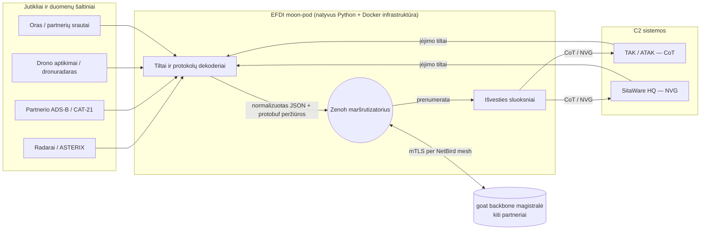
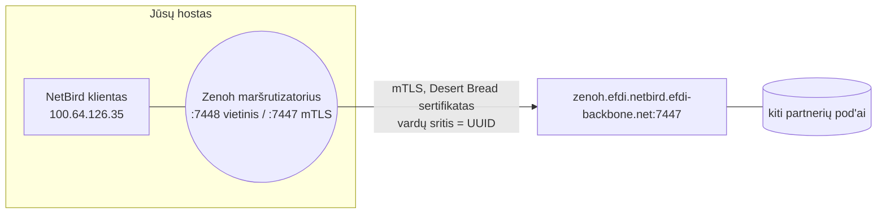

# 01 — Architektūra (EFDI nuo A iki Ž)

Šis dokumentas paaiškina visą projektą nuo pagrindų, skaitomas vieną kartą
nuo pradžios iki galo: kas tai yra, kodėl reikalinga kiekviena dalis, kaip
realiai juda duomenys ir kaip tai eksploatuoti. Perskaitę jį ištisai,
galėsite tai paaiškinti kolegai neatsivertę kodo.

Jei turite laiko tik vienam skyriui, rinkitės
**[2. Vieno sakinio modelis](#2-vieno-sakinio-modelis)** ir
**[6. Kaip duomenys iš tikrųjų juda](#6-kaip-duomenys-iš-tikrųjų-juda)** —
jie perteikia esmę.

---

## 1. Kas yra EFDI

EFDI verčia jutiklių duomenis į C2 sistemų kalbą, o viduryje turi bendrą
žinučių magistralę.

Vienoje pusėje — jutikliai ir duomenų šaltiniai, kiekvienas su savo tarme:
radarai kalba ASTERIX kalba, orlaivių atsakikliai — ADS-B, prisideda
akustiniai drono aptikimo jutikliai, oro stotys, partnerių srautai. Kitoje
pusėje — komandavimo ir valdymo (C2) sistemos, kurias operatoriai iš
tikrųjų stebi ekrane: **TAK** (ATAK/WinTAK), kalbantis Cursor-on-Target
(CoT) protokolu, ir **SitaWare HQ**, kalbantis NVG protokolu.

Tarp jų stovi **Zenoh** — publikavimo/prenumeravimo (pub/sub) magistralė.
EFDI dekoduoja kiekvieno jutiklio tarmę į vieną bendrą takelio modelį,
paskelbia jį Zenoh tinkle su griežtai apibrėžtu temos pavadinimu, o tada
vėl užkoduoja tuo formatu, kurio reikia konkrečiai C2 sistemai. Ryšys
veikia ir atvirkščiai — takeliai ištraukiami iš C2 sistemų atgal į
magistralę, tad bendras vaizdas dalinamasi abiem kryptimis.

Tokį rinkinį vadiname „moon-pod": savarankišką paketą, kurį partneris
paleidžia savo aparatinėje įrangoje ir savo tinkle, prijungtą prie bendros
**backbone magistralės**. Taip daug partnerių gali keistis takeliais,
niekam neatiduodant savo duomenų kontrolės.

**Kur EFDI įsikomponuoja į vaizdą — ir kodėl tai svarbu.** EFDI sukurtas
veikti *šalia* jūsų esamo C2 steko, ne vietoj jo. Jis stovi arba tiesiog
šalia paties TAK serverio ir SitaWare HQ serverio, arba bent jau pasiekiamas
jiems tinklu, ir kalba jų natyviu laidiniu protokolu tiesiogiai — CoT per
TAK TCP prievadą, NVG per SitaWare HTTP srautą. Būtent dėl šio tiesioginio
prisijungimo prie serverio ir egzistuoja vertimo sluoksniai: EFDI pats
prisiima naštą išmokti kiekvienos C2 sistemos kalbą, kad operatoriaus
įrankis gautų lygiai tai, ko jis jau tikisi — o EFDI tik praturtina tą
vaizdą sulietais, kelių šaltinių takeliais, neverčiant nieko keisti savo
darbo įpročių.

## 2. Vieno sakinio modelis

> **Dekoduoti daug jutiklių tarmių → normalizuoti į vieną takelį →
> paskelbti Zenoh tinkle griežtu temos pavadinimu → vėl užkoduoti kiekvienai
> C2 sistemai (ir priimti jos takelius atgal).**

Viskas kita šioje sistemoje — mesh VPN, sertifikatai, taksonomija, web UI,
prižiūrėtojo procesas — egzistuoja tik tam, kad šis vienas sakinys veiktų
patikimai, saugiai ir būtų valdomas.

## 3. Bendras vaizdas



Vaizdą skaitykite kaip tris etapus iš eilės: **įvedimas** (kairėje),
**magistralė** (viduryje), **išvedimas** (dešinėje). Ketvirtas dalykas,
**backbone**, iš tikrųjų yra tik dar daugiau prenumeratorių ir leidėjų,
pasiekiamų per VPN mesh — ne atskira sistema.

## 4. Pagrindinis žodynas

| Terminas | Kas tai |
|---|---|
| **Zenoh** | Pub/sub magistralė: leidėjas parašo (`put`) baitus po *raktu* (tema, pvz. `a/b/c`), prenumeratorius atitinka raktus pakaitos simboliais (`a/**`). Tarpininko (broker) nėra — maršrutizatoriai tik persiunčia. |
| **raktas / tema** | Brūkšneliais atskirtas pavadinimas, po kuriuo paskelbtas pavyzdys. EFDI rakto struktūra ir yra pati *taksonomija* (§6.3). |
| **ASTERIX** | EUROCONTROL dvejetainis radaro formatas. Kiekviena kategorija (CAT-048 taikiniai, CAT-034 tarnyba, CAT-021 ADS-B, CAT-020 MLAT, CAT-062 sistemos takeliai) atitinka savo aptikimo metodą. |
| **CoT** | Cursor-on-Target — XML formatas, kuriuo kalba TAK/ATAK. |
| **NVG** | NATO Vector Graphics 2.0.2 — XML, kurį SitaWare gauna apklausdamas per HTTP. |
| **SAPIENT / BSI Flex 335** | Standartinė jutiklio pranešimų schema. Tai EFDI *kanoninė fabric sutarties* peržiūra, užkoduota kaip SAPIENT protobuf. |
| **track (takelis)** | Vienas normalizuotas stebėjimas — žodynas su pozicija, tapatybe, priklausomybe ir laiko žymomis. Bendra kalba tarp dekodavimo ir kodavimo pusių. |
| **bridge (tiltas)** | Procesas, kuris atneša išorinio šaltinio duomenis **į** Zenoh, arba ištraukia duomenis iš C2 sistemos. Priešdėlis pavadinime pasako kryptį. |
| **layer (sluoksnis)** | Procesas, kuris takelius iš Zenoh **išveda** į C2 sistemą. |
| **NetBird** | WireGuard mesh VPN, jungiantis pod'ą su backbone (kiekvienas peer'is gauna `100.64.x.x` adresą). |
| **mTLS** | Abipusis TLS, kai abi pusės pateikia sertifikatus. Pod'o sertifikatas kartu yra ir jo tapatybė, ir jo rašymo teisė magistralėje. |
| **slot / namespace (vardų sritis)** | Rakto priešdėlis, kurį pod'as turi teisę rašyti. Backbone tinkle tai organizacijos **UUID** (`1851281…`); bandymas rašyti už jos ribų tiesiog tyliai atmetamas. |
| **backbone / fabric (magistralė)** | Bendras goat Zenoh tinklas, prie kurio prisijungę visi partneriai. |
| **panoscope** | Backbone tikrinimo įrankis: piešia **mazgus** (pagal liveliness buvimą) ir **ryšius** (pagal srautą), kartu su schemos vaizdu. |
| **moon-pod** | Savarankiškas EFDI paketas, kurį valdo pats partneris. |

## 5. Du tinklai, kuriuos lengva supainioti

Tas pats pod'as vienu metu kalba su **dviem skirtingais Zenoh pasauliais**:

1. **Vietinė smėlio dėžė** — maršrutizatoriai jūsų pačių tinkle (LTU smėlio
   dėžė), su priešdėliu `LTU/CISB`. Naudojama kūrimui ir vietiniam
   testavimui; sertifikatus pasirašo vietinė `efdi-root-ca`.
2. **goat backbone** — bendra hackathon magistralė adresu
   `zenoh.efdi.netbird.efdi-backbone.net:7447`, pasiekiama per NetBird mesh.
   Priešdėlis čia — jūsų organizacijos **UUID**, sertifikatus pasirašo
   **Desert Bread** CA.

Kad tilto scenarijui apskritai nereikėtų žinoti apie backbone egzistavimą,
pats pod'o Zenoh maršrutizatorius federuoja abu pasaulius: vietiniai tiltai
publikuoja maršrutizatoriui adresu `127.0.0.1:7448` (paprastu tekstu, tik
loopback), o maršrutizatorius jau pats persiunčia viską, kas patenka į
jūsų vardų sritį, į backbone per mTLS.

> Dažniausia painiava kyla būtent čia: `LTU/CISB` (vietinis priešdėlis)
> supainiojamas su UUID (backbone priešdėliu), ir pamirštama, kuri CA ką
> pasirašo. Trumpai: backbone = **UUID priešdėlis + Desert Bread
> sertifikatai**.

## 6. Kaip duomenys iš tikrųjų juda

### 6.1 Įvedimas — nuo antenos iki magistralės

Pažiūrėkime, kaip tai vyksta radaro pavyzdžiu:

1. Radaras UDP protokolu siunčia **ASTERIX CAT-048** baitus.
2. `udp_ingress_bridge.py` gauna neapdorotą datagramą ir publikuoja ją
   nepakeistą **raw** rakte (`{root}/raw/asterix/cat048`) — čia dar nieko
   nedekoduojama, tik pergabenama.
3. ASTERIX dekoderio procesas (`protocols/vendors/asterix/cat.py`,
   paleistas su `--category` parametru) prenumeruoja tą raw raktą,
   dekoduoja dvejetainį įrašą į **takelio žodyną** (lat/lon, aukštis,
   takelio numeris, SAC/SIC jutiklio ID ir t.t.) ir pasirūpina visais
   bitų lygio ASTERIX niuansais (jie dokumentuoti `../.ai/.claude/CLAUDE.md`).
4. Dekoderis perduoda rezultatą **publikavimo pagalbininkams** modulyje
   `protocols/track_views.py` — jie sudaro taksonomijos raktą ir paskelbia
   **kelias to paties takelio peržiūras vienu metu** (§6.4).

Kiti šaltiniai paprastesni — partnerio ADS-B duomenys jau atkeliauja per
registruotas fabric temas arba tiesiai ASTERIX CAT-021 formatu. Šablonas
visada tas pats: **dekoduoti → sudaryti takelio žodyną → paskelbti per
pagalbininką.**

### 6.2 Normalizuotas takelis

Kad ir kokį jutiklį dekoduotume, gauname tos pačios formos plokščią
žodyną, pavyzdžiui:

```json
{ "_ts": 1730000000.0, "_src": "partner-adsb", "uid": "4ca7b3",
  "lat_deg": 54.68, "lon_deg": 25.28, "geo_alt_m": 10668,
  "callsign": "RYR1AB", "affiliation": "civ", "heading_deg": 91.0 }
```

Tai ir yra visa sąsaja tarp dviejų pusių: bet kas, kas moka sukurti tokį
žodyną, gali prisijungti prie magistralės, o bet kas, kas moka jį
perskaityti, gali atvaizduoti duomenis bet kokioje C2 sistemoje.

### 6.3 Temos raktas (taksonomija)

Rakte slypi visa sistemos „intelektas". Pilna forma (žr.
`13-temu-taksonomija.md`):

```
{prefix}/{domain}/{source}/{modality}/{affiliation}/{entity}/{type}/{id}[/{view}]/tracks/v1
```

- **prefix** — jūsų vardų sritis (backbone tinkle tai UUID).
- **domain** — sritis: `air` / `land` / `sea` / `space`.
- **source** — KAS tai pastebėjo (`partner-adsb`, radaras `SAC-SIC`) —
  duomenų kilmė.
- **modality** — KAIP tai buvo pastebėta (`radar`, `adsb`, `acoustic`) —
  pagal šį lauką filtruoja C2 vartotojas.
- **affiliation** — priklausomybė: `civ` / `mil` / `friendly` / `hostile` /
  `neutral` / `unknown`.
- **entity / type / id** — kokio tipo objektas, koks jo konkretus tipas ir
  koks jo stabilus identifikatorius.
- **view** — kuriuo kodavimu paskelbtas tas pats objektas (§6.4).
- **`/tracks/v1`** — privaloma fabric sutarties galūnė (§7).

Visą šį raktą sudaro viena vienintelė funkcija — `semantic_topic()` faile
`track_views.py`. Taip visa taksonomijos logika gyvena vienoje vietoje, o
ne išbarstyta po 26 skirtingas publikavimo vietas kode.

### 6.4 Keturios peržiūros — vienas takelis, keturi kodavimai

Kiekvienas takelis skelbiamas iškart keturiais gretimais raktais, kad
skirtingi vartotojai galėtų rinktis norimą kodavimą be jokio išankstinio
susitarimo:

| Peržiūra | Rakto galūnė | Turinys | Laidinis kodavimas |
|---|---|---|---|
| **json** (kanoninė) | `…/{id}/tracks/v1` | plokščias JSON | `application/json` |
| **sapient** | `…/{id}/sapient/tracks/v1` | BSI Flex 335 v2 protobuf (sutartis) | `application/protobuf;…SapientMessage` |
| **proto** | `…/{id}/proto/tracks/v1` | EFDI protokolo-specifinis protobuf (pilna detalė) | `application/protobuf;…<Track>` |
| **raw** | `…/{id}/raw/tracks/v1` | originalūs laidiniai baitai, suvynioti į `RawEnvelope` | `application/protobuf;…RawEnvelope` |

Protobuf peržiūros yra **savaime aprašančios**: pačioje kodavimo eilutėje
jau yra ir protobuf pranešimo pavadinimas, tad magistralės schemos
peržiūrėtojui nereikia jokios papildomos paieškos, kad juos dekoduotų
(žr. `proto_encoding()` faile `track_views.py`).

### 6.5 Išvedimas — nuo magistralės iki C2

Išvesties sluoksniai prenumeruoja su `**` pakaitos simboliu, kuris
automatiškai apima ir `/tracks/v1` galūnę, ir paverčia gautus duomenis:

- **`tak_layer.py`** prenumeruoja takelio raktus, iš jų sukuria **CoT
  XML** ir transliuoja **TAK serveriui** per TCP/TLS 8089 prievadą. Ne-JSON
  peržiūros čia praleidžiamos, kad protobuf turinys niekada nebūtų
  klaidingai palaikytas JSON.
- **`sitaware_layer.py`** paverčia takelius **NVG 2.0.2** elementais (su
  APP-6 simboliais) ir pateikia juos kaip vieną dokumentą per HTTP(S) —
  **SitaWare pati jį apklausia**.

### 6.6 Įėjimas iš C2 (atvirkštinis kelias)

- **`tak_bridge.py`** skaito CoT XML iš TAK ir persiskelbia normalizuotus
  takelius atgal į Zenoh, pažymėdamas juos taip, kad `tak_layer` jų
  neatspindėtų atgal į TAK.
- **`sitaware_bridge.py`** apklausia SitaWare REST API dėl vienetų
  pozicijų ir jas persiskelbia — tai vienintelis SitaWare įėjimo kelias,
  atskiro NVG-XML priėmimo tilto nėra.

### 6.7 Vykdomi nuorodiniai pavyzdžiai

Kataloge `examples/` yra iliustraciniai, o ne produkciniai pavyzdžiai
leidėjams, norintiems rašyti į EFDI duomenų magistralę — juos verta
pritaikyti savo reikmėms, o ne tiesiog importuoti kaip biblioteką.
Kanoninės sutartys aprašytos šiame dokumente ir faile
`13-temu-taksonomija.md`; šie pavyzdžiai tik parodo, kaip tai atrodo
veikiančiame kode:

| Pavyzdys | Ką jis parodo | Kokia sutartis |
|---|---|---|
| `delivery_reconcile.py` | Kaip leidėjas savarankiškai stebi, ar jo duomenys iš tikrųjų pasiekia tikslą: laikomas ketinimų žurnalas, patys sau patikrina savo išvestį (self-canary) ir skleidžiamas ketinimo „širdies plakimas", kad jūs (ir operatoriaus stebėjimo sistema) pastebėtumėte, jei rašymai tyliai liaujasi veikti. | pristatymo suderinimo šablonas |
| `self_describing_encoding.py` | Kaip publikuojant nustatyti Zenoh `Encoding`, kad iš karto būtų aišku, koks formatas siunčiamas (JSON / CBOR / protobuf su schema) — vartotojas tada renkasi dekoderį pagal `sample.encoding` lauką, o ne spėja iš šalies. | savaime aprašantis turinys |
| `resilient_subscriber.py` | Prenumeratorių, kuris išgyvena ryšio nutrūkimą: (per)sijungęs jis pasiveja praleistą istoriją, periodiškai atgauna prarastus pavyzdžius ir sužino, kurie konkrečiai buvo praleisti (dirbant kartu su tinkamu privalomo-pristatymo leidėju). | pažangaus prenumeratoriaus šablonas |
| `must_deliver_publisher.py` | 3-io lygio palydovą pristatymo suderinimui — pažangų leidėją, kuris pats talpina neseniai siųstus pavyzdžius (kad galėtų atsakyti į pakartotinio siuntimo prašymus), naudoja sekos numerius ir širdies plakimus tikram praleidimų aptikimui bei skelbia savo buvimą. Tai patikimumas pačiame krašte, ne per centrinį tarpininką. | pažangaus leidėjo šablonas |
| `liveliness_presence.py` | Natyvų buvimo mechanizmą: deklaruojamas liveliness žetonas, sakantis „aš egzistuoju", o stebint buvimo rakto išraišką iškart sužinoma, kai peer'is prisijungia ar atsijungia (įskaitant esamą visų dalyvių sąrašą iš istorijos) — vietoj to, kad būtų spėliojama iš bendro srauto. | liveliness buvimo šablonas |

Paskutiniai keturi pavyzdžiai yra „atsparūs / pažangūs" šablonai —
naudokite juos tik tiems srautams, kuriems tikrai reikia pasivijimo,
privalomo pristatymo ar buvimo stebėjimo. Jei duomenų praradimas
telemetrijoje nekritinis, pakanka paprasto `put` + 0-io lygio suderinimo;
nemokėkite sudėtingumo kaina už garantijas, kurių srautui iš tikrųjų
nereikia.

Ryšio parametrus (maršrutizatoriaus galinį tašką, mTLS sertifikatą, raktą
ir CA šaknis, sugeneruotus `scripts/gen-certs.sh`) gausite iš savo pod'o
operatoriaus — konkrečius aplinkos kintamuosius žr. kiekvieno scenarijaus
antraštėje. Priklausomybė viena: `pip install eclipse-zenoh==1.9.0` (tai
fiksuota visai flotilei versija); pažangaus leidėjo/prenumeratoriaus ir
liveliness API rasite to paketo `zenoh.ext` ir `session.liveliness()`
dalyse.

## 7. Fabric sutartis — kodėl „ar mane matyti panoscope?" iš viso yra klausimas

Tai, kad duomenys *teka* per backbone, ir tai, kad jie *rodomi* panoscope
įrankyje — du visiškai skirtingi dalykai. Matomumą lemia trys taisyklės:

1. **`/tracks/v1` galūnė.** Backbone įėjimo taškas priima tik tuos takelio
   raktus, kurie baigiasi `/tracks/v1`. Praleidus šią galūnę, duomenys
   atmetami dar prie pačios ribos. (Būtent tai kadaise sukėlė regresiją,
   kai viskas, išskyrus OpenSky, buvo atmetama.)
2. **Liveliness buvimas = mazgai.** panoscope nupiešia **mazgą** pagal
   Zenoh *liveliness žetoną*, o ne pagal patį srautą.
   `compose/control/presence.py` deklaruoja po vieną tokį žetoną
   kiekvienam realiai veikiančiam srautui adresu
   `{prefix}/_meta/alive/<service>`. Be jo jūsų duomenys tampa matomi
   kaip ryšiai (edges), bet patys niekada nenupiešiami kaip mazgas.
3. **Savaime aprašantis kodavimas = schemos šeimos.** Protobuf, pažymėtas
   savo pranešimo pavadinimu (`proto_encoding()`), leidžia schemos
   peržiūrėtojui iš karto suprasti, kokiai šeimai jūsų peržiūra priklauso.
   Grynas `application/protobuf` be žymos rodomas kaip neklasifikuotas.

Visos trys taisyklės jau įgyvendintos — žr. skyrių „Fabric sutartis" faile
`13-temu-taksonomija.md`.

## 8. Kaip pod'as prisijungia (mesh, sertifikatai, vardų sritis)



- **NetBird** prijungia hostą prie mesh tinklo (`netbird up` komanda su
  rinkinio setup raktu). Kiekvienas peer'is gauna `100.64.x.x` adresą;
  mesh tinklas net turi savo DNS (`*.efdi.netbird.efdi-backbone.net`).
- Maršrutizatorius per **mTLS** skambina backbone tarpiniam serveriui
  (gateway). Jo **kliento sertifikatas** (subject `CN=<UUID>`, SAN
  `URI:urn:goat:efdi:org=<UUID>`, pasirašytas Desert Bread) vienu metu
  atlieka dvi funkcijas — tai ir jo tapatybė, ir jo **rašymo teisė**: jam
  leidžiama publikuoti tik po `<UUID>/**` raktu.
- `verify_name_on_connect` šiuo metu **išjungtas**, nes pod'as šiuo metu
  skambina maršrutizatoriui pagal mesh IP adresą, o ne DNS vardą. Pagal
  sutartį reikėtų skambinti DNS vardu su įjungta patikra — žr. ryšio
  pastabas faile `08-integracijos.md`.

## 9. Vykdymo ir proceso modelis

EFDI iš esmės yra **natyvūs Python procesai, o Docker naudojamas tik
infrastruktūrai.**

- **Docker (tik infrastruktūrai):** `zenoh-router`, `zenoh-admin` (web UI)
  su savo DB ir proxy, `step-ca` (vietinė sertifikatų institucija) ir
  docker-socket-proxy.
- **Natyvūs procesai (duomenų plokštuma):** kiekvienas tiltas, protokolo
  dekoderis ir sluoksnis veikia kaip atskiras, prižiūrimas Python
  procesas. `start.sh` juos paleidžia, kiekvienai paslaugai įrašydamas
  pidfile faile `compose/state/.pids/`; `supervisor.py` kas ~15 sekundžių
  patikrina visus ir persileidžia bet kurį, kurio pidfile yra, bet
  procesas jau dingęs.
- **Dvi virtualios aplinkos:** `compose/venv` (eclipse-zenoh vykdymo
  aplinka) ir `compose/zenoh-admin/.venv` (web UI ir testavimo įrankiai).
- **Įėjimo taškai:** `install.sh` (pirmo karto sąranka), `start.sh`
  (interaktyvus paslaugų meniu, arba `--service <vardas>` neinteraktyviam
  paleidimui), `stop.sh` ir `run.sh`.

`start.sh` yra idempotentiškas, o prižiūrėtojo procesas veikia nuolat, tad
duomenų plokštumą paleisti ir palaikyti veikiančią lengva: sugedęs srautas
atsigauna savaime, be rankinio įsikišimo.

## 10. Kiekvienos paslaugų kategorijos paskirtis

| Kategorija | Pavyzdžiai | Rolė |
|---|---|---|
| **Atviro kodo duomenų tiltai** | `meteolt` | Apklausia viešai prieinamus srautus ir paverčia juos takeliais |
| **Jutiklių tiltai** | `asterix`, `sitaware`, `dronuradaras`, `track-fusion`, `*-raw` | Priima jutiklių ar neapdorotų lizdų duomenis |
| **Protokolai** | `sapient`, `stanag4586/4609`, `cap`, `mqtt`, `sparkplug`, `nffi` | Dekoduoja laidinį protokolą, atkeliavusį neapdorota Zenoh tema, į takelius |
| **Išvesties sluoksniai** | `tak_layer`, `sitaware_layer` | Perduoda takelius į TAK / SitaWare |
| **C2 įvestys** | `tak-bridge`, `sitaware` | Priima duomenis iš TAK / SitaWare |
| **Infrastruktūra** | `zenoh`, `admin-control`, `supervisor`, `presence`, `cert-renewer` | Maršrutizatorius, web UI, procesų priežiūra, buvimo skelbimas, sertifikatų rotacija |

## 11. Saugumas ir suverenitetas

- **Sertifikatai niekada negyvena repozitorijoje.** Jie ateina iš
  pasirašyto rinkinio ar vietinės CA ir laikomi keliuose, kurie
  `.gitignore` sąraše. Failas `compose/.env` (jame — paslaptys, API
  raktai, portalo žetonas) irgi `.gitignore` sąraše ir lieka tik vietoje.
- **Sertifikatas ir yra autorizacija.** Bandymas publikuoti už savo vardų
  srities ribų tyliai atmetamas maršrutizatoriaus ACL taisyklės — tai
  numatytas elgesys, ne klaida.
- **Suverenitetas.** Pod'as veikia partnerio pačios aparatinėje įrangoje,
  jo būsena saugoma šifruotame tome, audito žurnalus laiko pats
  partneris; partneris bet kada gali atsišakoti (fork) ir prisiglaudinti
  sistemą pats. (Pilnas šio principo aprašymas — goat „partnerio
  sutartyje", žr. smėlio dėžės nuorodinę repozitoriją.)
- **Paprasto teksto vietinis prievadas (`:7448`) skirtas tik loopback
  ryšiui** ir pasitiki bet kokiu prie jo prisijungusiu vietiniu procesu —
  todėl jo niekada negalima atverti už pačios dėžės ribų.

## 12. Eksploatavimas — patikrinti keliai

### Paleisti viską ir palaikyti veikiantį
```bash
./start.sh                 # interaktyvus meniu, arba:
./start.sh --service presence   # paleisti vieną konkrečią paslaugą neinteraktyviai
```
Prižiūrėtojo procesas rūpinasi, kad sukonfigūruotos paslaugos liktų
veikiančios; `presence` jas paskelbia kitiems.

### Patikrinti, kas veikia
```bash
ls compose/state/.pids/                 # po vieną pidfile kiekvienai veikiančiai paslaugai
docker ps                               # ar infrastruktūros konteineriai sveiki?
tail -f compose/state/logs/<svc>.log    # konkrečios paslaugos žurnalas
```

### Patikrinti, ar duomenys iš tikrųjų pasiekia backbone
```bash
# klientas, prijungtas tik prie backbone su išjungtu scouting, turėtų matyti
# jūsų 1851281…/…/tracks/v1 raktus šalia kitų partnerių priešdėlių
```

**Norite pridėti naują jutiklio srautą?** Parašykite dekoderį, kuris
sukuria takelio žodyną (§6.2), iškvieskite `track_views` publikavimo
pagalbininkus ir įregistruokite naują paslaugą `start.sh` faile
(`SERVICES`, `SVC_CAT`, `SVC_DESC`, `svc_ready` bei atitinkamas `launch`
atvejis).

**Norite prijungti C2 sistemą?** Nustatykite `TAK_*` (CoT) arba
`SITAWARE_*` (NVG) kintamuosius `compose/.env` faile, tada paleiskite
`tak_layer` / `sitaware_layer` (išvesčiai) ir, jei reikia,
`tak-bridge` / `sitaware` (įvesčiai). Konfigūraciją po pradinės sąrankos
geriausia atlikti per web UI (`zenoh-admin`), ne rankiniu būdu.

## 13. Kur slypi pagrindinės rizikos (pastebėti dalykai ir atviri klausimai)

- **ASTERIX bitų numeravimas** yra dažniausias klaidų šaltinis —
  EUROCONTROL bitus skaičiuoja nuo 8 iki 1, o Python — nuo 7 iki 0.
  Pasikartojantys šio tipo klaidų šablonai dokumentuoti
  `../.ai/.claude/CLAUDE.md`; laikykite
  `protocols/vendors/asterix/cat.py` jautriausiu klaidoms failu visame
  repozitorijoje.
- **`13-temu-taksonomija.md`** dabar atspindi galiojančią `/tracks/v1`
  sutartį — senesnės pastabos kitur gali jos jau nebeatitikti, tad
  patikimiausias šaltinis visada yra taksonomijos dokumentas.
- **Backbone pasiekiamumas** priklauso nuo to, ar veikia NetBird mesh ir
  ar patys backbone maršrutizatoriai pasiekiami; peer'ių būseną parodo
  `netbird status`. Maršrutizatoriaus konfigūracijoje nurodyti keturi
  `connect` galiniai taškai, bet keli iš jų nurodo į pasenusius IP
  adresus — šiuo metu realiai veikia tik tas, kuris pasiekiamas per
  `zenoh.efdi.netbird.efdi-backbone.net`; kitus vertėtų apkarpyti ir
  palikti tik šį DNS galinį tašką.
- **C2 išvestis** į TAK/SitaWare veiks tik tada, jei tos sistemos
  pasiekiamos pod'o tinkle — iš backbone mesh pusės jos gali būti
  nepasiekiamos visai. Tai maršrutizavimo ar dvigubo prijungimo
  klausimas, ne EFDI klaida.

---

*Šis dokumentas — žemėlapis, ne pati teritorija. Autoritetingi šaltiniai:
`../.ai/.claude/CLAUDE.md` (kodavimo taisyklės ir ASTERIX niuansai),
`13-temu-taksonomija.md` (pats raktas), `00-pradekite-cia.md` (sąranka ir
prijungimas) — ir, žinoma, pats kodas.*
