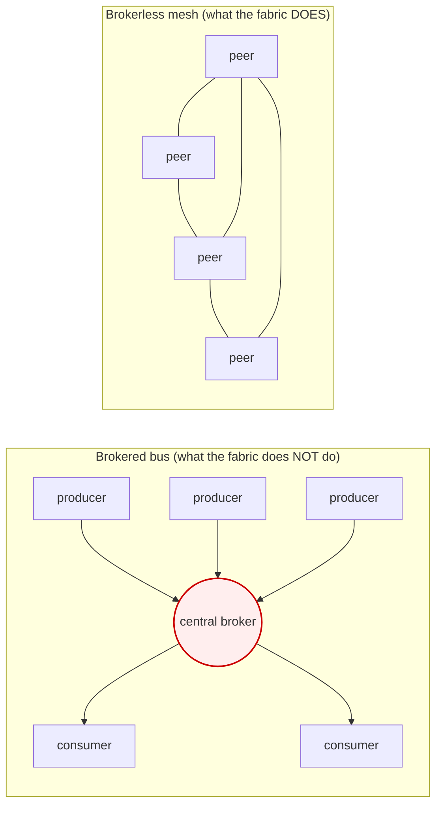
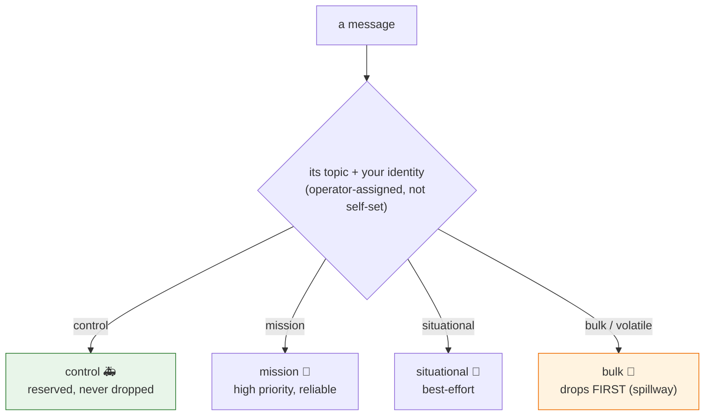
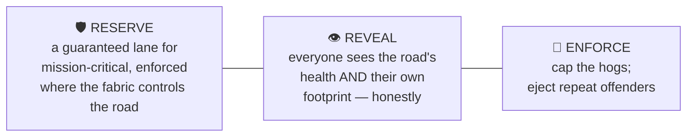
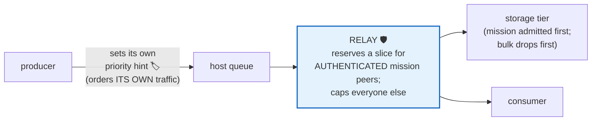
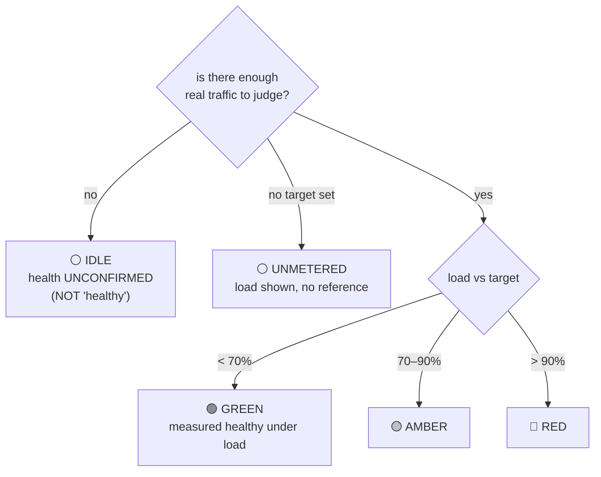

# Quality of Service — how the fabric protects what matters

> **A guide in two reading levels.** Each idea is explained first in plain language
> (the **In short** line), then with the real mechanism (the **Deeper** note). If you only
> read the **In short** lines and look at the pictures, you'll get the whole story.
>
> This is the "why and when" companion to the [`examples/`](../examples/README.md) (the "how").
> What it means *for you, the partner*: pick the right reliability for each of your streams,
> read the health gauge honestly, and stay a good neighbour on a shared road.

---

## The promise, in one paragraph

The fabric carries everything from life-or-death command messages to bulk file transfers over the
same mesh. **The most important data must keep flowing even if everything else misbehaves at
once** — a buggy sensor, a hostile peer, a saturated link. This guide explains how that's made
true *without* a central traffic cop (there deliberately isn't one), how everyone can *see* the
network's health honestly (no fake "all clear"), and what you do as a producer to fit the model.

---

## 1. The hard part: there is no central traffic cop

**In short.** Most messaging systems have a single hub every message passes through (a "broker") —
one convenient place to enforce priority. The fabric doesn't have one. Your data goes **directly,
peer to peer**, like cars on a road network with no central tollbooth. That's what lets it scale,
but it means priority can't be enforced at one gate. It's enforced at every junction instead.

**Deeper.** The fabric is brokerless (Zenoh over a WireGuard mesh). A central broker would be a
single chokepoint and a single point of failure for the mission. The trade is that Quality of
Service becomes a *per-hop* discipline (the same model the internet uses — DiffServ), not a
central-controller one. The practical consequence for you: **reliability is cooperative + local**,
which is exactly why the producer-side patterns in the examples exist.

*The broker is one place to enforce priority — and one place to fail, and one ceiling on scale.
The mesh has neither; QoS is enforced at each junction the traffic actually crosses.*

---

## 2. The lanes: four traffic classes

**In short.** All traffic is sorted into **four lanes** by how important it is — like a road with
an **ambulance lane**, a **mission lane**, a **normal lane**, and a **bulk/cargo lane**. The bulk
lane is the first to slow down when the road gets busy, so the important lanes stay clear.

**Deeper.** A message's lane is fixed by its **topic** and your **verified identity** — both
access-controlled. **You cannot promote your own traffic to a higher lane.** Which of *your*
topics map to which lane is set with your goatnet operator at onboarding (part of your
[partner contract](partner-contract.md)), not chosen by your code at publish time. The lanes,
with illustrative kinds of traffic:

| Lane | Class | Typically carries | Under pressure |
|---|---|---|---|
| 🚑 Ambulance | **control** | commands, tasking, acknowledgements, the health signal itself | reserved, never dropped |
| 🎯 Mission | **mission** | tracks, alerts, detections, releases | high priority, reliable |
| 🚗 Normal | **situational** | telemetry, component output, routine health | best-effort |
| 🚚 Bulk | **bulk** | high-rate non-persisted streams + large-file transfer | **drops first** — the spillway |

*The non-persisted "volatile" class (high-rate telemetry + large files) is deliberately the bottom
lane — it's loss-tolerant by design, so it sheds first and protects the lanes above it. Put your
firehose and your bulk file moves there on purpose.*

---

## 3. The three pillars

Everything rests on three ideas. **Reserve** keeps a lane clear for the mission; **Reveal** lets
everyone see the road honestly; **Enforce** stops the hogs. Cooperation is the optimization on
top — it is *never* the guarantee.

### Pillar 1 — Reserve: a guaranteed lane, recognized by *credentials* not by a *sticker*

**In short.** A slice of the road is kept **permanently reserved** for mission-critical traffic.
And crucially: a peer is recognized as "allowed in the ambulance lane" by its **verified
credentials**, *not* by a sticker anyone could print. A flood can't just *claim* to be important.

**Deeper.** The reservation is enforced at every point the fabric controls — the **relay** (the
shared waypoint for flows that can't go direct), the **storage tier**, and **owned-host network
queues**. It keys on **authenticated peer identity**, **not** on a priority byte the sender sets —
because the relay forwards opaque encrypted packets and an untrusted producer controls its own
header. This is the single most important correctness point: **a hostile producer cannot paint
"ambulance" on its truck.**

*Your own priority is a hint that orders **your own** traffic. The guarantee lives where the fabric
controls the path and keys on **who you are**, verified — not what you claim.*

### Pillar 2 — Reveal: an honest gauge everyone can read (including their own footprint)

**In short.** There's a big, honest **health gauge** anyone can read — via `goat health` — showing
how busy each lane is and **how much of the road *you* are using**. When it can't tell, it says
**"I can't tell,"** never a fake "all clear." Seeing your own impact is what lets you self-correct.

**Deeper.** A small always-on meter watches the traffic that's *already flowing* and publishes the
picture back onto the bus. It's **honest by construction** — see §4. Use it: before you turn up a
high-rate stream, glance at the gauge; if your footprint is climbing toward a cap, back off or move
the stream to the bulk lane.

### Pillar 3 — Enforce: cap the hogs, eject the repeat offenders

**In short.** A producer using too much gets its speed **capped**. A persistent abuser gets its
**road pass revoked** entirely.

**Deeper.** Over-rate producers are flagged by an expected-vs-actual monitor; per-peer caps at the
relay are the hard ceiling; and the brokerless-correct way to stop a bad actor is to **eject it
from the mesh** (credential revocation) — not to rate-limit it in a central data-plane component
that doesn't exist. The takeaway for a well-behaved partner: the system protects the mission
*from* a bad neighbour, so being a good neighbour is simply staying off the enforcement radar.

---

## 4. How you *know* it's working — without ever being lied to

This is the part people care about most, because **a health gauge that lies is worse than none** —
a fake "green" gets trusted, and someone relies on capacity that isn't there. Five rules are
non-negotiable:

**In short.**
1. **An honest "I can't tell" beats a fake "all clear."** A lane with no traffic shows
   **IDLE — unconfirmed**, *not* green. Green means *measured healthy under real traffic*.
2. **Every reading shows its evidence** — how many messages it's based on, over what window. You
   can always ask "is this green *measured*, or just *quiet*?"
3. **Measured, assumed, and inferred are never confused.** Live load is *measured*; the capacity
   target is an *estimate* from periodic load-tests; headroom is *inferred* from the two — and the
   gauge keeps them visibly separate.
4. **One glance on top, detail underneath** — a single dipstick (GREEN / AMBER / RED / IDLE).
5. **Measuring must not slow the network.** The meter *rides existing traffic* (adds nothing).
   Test traffic is only generated when a lane is **quiet**, and stops the instant real traffic
   returns.

*The gauge has **five** states, not three. A quiet lane is `IDLE`, never a false green.*

### What's measured, and what isn't (honest about the layers)

**In short.** Today's gauge measures **how busy each lane is** (passive, free). The health of the
underlying links and the true ceiling are measured **elsewhere** and aren't folded into this gauge
*yet* — and the gauge says so rather than implying it measures everything. A transit link the
fabric doesn't own (e.g. a commercial satellite segment) in particular **cannot be guaranteed** —
no design can reserve bandwidth on someone else's link — so it's **measured and shown** rather than
painted green by assumption.

---

## 5. The concerns this resolves

> **"What stops another partner from flooding the network and starving my mission data?"**
> They can't even *write* to a higher lane — lanes are gated by identity + topic, both verified.
> Bulk traffic is in the drop-first lane. At the shared relay every peer is capped per-peer, and
> the mission slice is reserved for *authenticated* mission peers, so a flood lands in the leftover
> best-effort pool. Persistent abuse → ejected from the mesh. The mission lane's guarantee does
> **not** depend on the flooder's goodwill.

> **"How do I trust the green light?"**
> Green only appears when the lane was **measured** healthy under **real load**, and the reading
> carries its evidence (the sample count). A quiet lane shows **IDLE (unconfirmed)**, never a fake
> green. No target → **UNMETERED**, not green.

> **"Does monitoring the network add load and become the problem?"**
> No. The meter is **passive** — it watches traffic already flowing and adds nothing, and its own
> health signal rides the reserved control lane so it can never crowd out the mission.

> **"What about a link nobody controls?"**
> The fabric reserves at every point it controls (relay, storage, its own hosts). A third-party
> transit segment is **measured and surfaced** honestly — never painted green by assumption.

---

## 6. What this means for you (the short checklist)

- **Match reliability to the stream, don't over-buy it.** Loss-tolerant telemetry → plain publish
  (cheapest); add producer-side reconciliation if you want to *know* when your writes stop landing
  ([`delivery_reconcile.py`](../examples/delivery_reconcile.py)). A stream that genuinely must not
  drop → the must-deliver publisher ([`must_deliver_publisher.py`](../examples/must_deliver_publisher.py)).
  Over-confirming everything loads the fabric for no benefit.
- **Put your firehose and big files in the bulk/volatile lane on purpose** — it's the spillway, so
  your own high-rate data doesn't threaten anyone's mission traffic (and won't be throttled as a
  hog for being where it belongs).
- **Read the gauge before you scale up.** `goat health` shows each lane's load and *your own*
  footprint. If you're trending toward a cap, back off or move to the bulk lane.
- **You don't set your own class.** Which topics ride which lane is agreed with your goatnet
  operator at onboarding — see the [partner contract](partner-contract.md). Trying to self-promote
  doesn't work and isn't necessary.
- **Subscribers should expect gaps and recover** — on a tactical link, partitions happen. Use the
  resilient subscriber ([`resilient_subscriber.py`](../examples/resilient_subscriber.py)) so you
  catch up what you missed instead of restarting cold.

---

## A note on honesty

Parts of this model are fully built (the lane model, the honest health gauge, the bulk-lane
spillway, ejecting a bad actor) and parts are still being built (the hardest piece — the relay's
reserved-slice guarantee against a determined adversary — is real engineering still ahead). Your
goatnet operator can tell you exactly what's live in the environment you're attached to. This guide
is the map; the authoritative, environment-specific detail comes with your onboarding and the
[partner contract](partner-contract.md).
